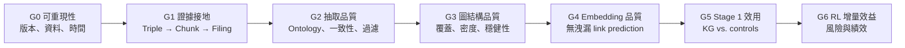
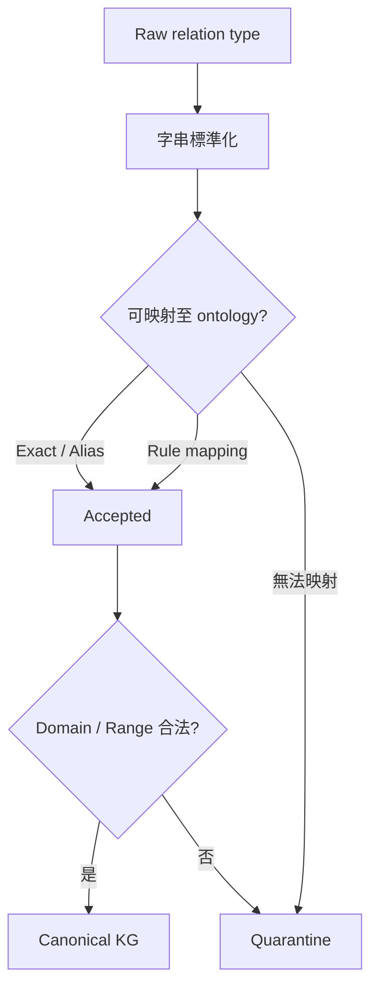

# GraphRAG 金融知識圖譜品質驗證與實作計畫

## 文件目的

本文件定義本研究後續的系統設計、品質驗證流程與測試驅動開發（Test-Driven Development, TDD）任務。研究優先順序為：

1. GraphRAG prompt 與 relation 抽取品質。
2. 資料、圖結構及統計結論的可信度。
3. PyKEEN embedding 的無洩漏評估。
4. Stage 1 representation learning 的獨立效用。
5. Stage 2 allocation optimization 的增量效益。

研究保留既有的 GraphRAG、PyKEEN、attention、兩階段訓練、Dow 30 universe，以及 AAPL、NVDA、AMZN、IBM、MSFT 固定五檔投資組合設定。

---

## 1. Problem Statement

目前專案已具備 GraphRAG、PyKEEN、attention pretraining 與 allocation optimization，但證據鏈尚未完全一致：

1. PyKEEN triple 無法追溯到原始財報段落。
2. PyKEEN 訓練圖與 ticker-level diagnostic graph 不是同一張圖。
3. Link prediction 使用隨機 triple split，可能高估泛化能力。
4. 靜態 KG 含時間洩漏風險。
5. Stage 1 與 RL 可以證明 KG「可能有用」，但不能反向證明 relation 忠於財報。
6. 沒有人工標註時，不能宣稱量得真正的 factual precision，只能證明來源可追溯性、自動一致性、外部結構一致性、穩健性及任務效用。

本研究目標是建立一條逐級品質閘門：



前一階段未通過時，不應將下一階段結果當成 KG 品質證據。

---

## 2. Requirements

### 2.1 保留的設計

- 使用 GraphRAG 建圖。
- 使用 PyKEEN 訓練 KG embedding。
- 保留 KG query/key 與 OHLCV value 的 attention 架構。
- 保留 Stage 1 預訓練、凍結 encoder、Stage 2 allocation optimization。
- 使用 Dow 30 universe。
- 使用 AAPL、NVDA、AMZN、IBM、MSFT 固定五檔投資組合。

### 2.2 新增要求

- 使用複合驗證，不依賴單一指標。
- 不進行人工標註。
- 先完成靜態 KG 品質閘門，再完成年度 point-in-time snapshots。
- Filing-level snapshot 列為延伸工作。
- Relation 先開放抽取，再映射至固定金融 ontology。
- 同時提供單次抽取低成本版與多次抽取完整驗證版。
- 資料完整性使用固定門檻；模型品質使用相對 control、effect size、confidence interval 與統計檢定。
- 優先改善 GraphRAG prompt 品質及統計可信度。

---

## 3. Research Findings

### 3.1 GraphRAG 原生支援證據鏈，但目前尚未完整使用

GraphRAG 官方輸出包含以下關係：

```text
relationships.text_unit_ids → text_units.document_id → documents
```

`text_units` 包含原始 chunk text，`documents` 包含文件內容及 creation metadata。因此，不需要另外要求 LLM 生成 citation；應直接保存 GraphRAG 的原生 ID 關聯。

目前 `setup/03_check_graphrag_output.py` 只將 `entities`、`relationships` 寫入資料庫，將 `text_units` 和 `documents` 當成 optional outputs。`setup/05_build_pykeen_triples.py` 又將資料縮減為：

```text
head, relation, tail
```

這是 provenance 消失的主要位置。

### 3.2 Prompt 存在格式矛盾

`extract_graph.txt` 規定每條 relationship description 必須包含：

```text
RELATION_TYPE: <relationship_type>;
```

但 prompt 的 Example 3 中，多條 relationship 並沒有此前綴。Few-shot example 與規則衝突，會讓模型學到錯誤格式。此問題應在任何模型比較前先修正，否則實驗比較的不只是模型能力，也包含 prompt inconsistency。

目前 relation type 完全由模型自由產生，容易造成：

- 同義詞分裂。
- 主被動方向不一致。
- Entity type 與 relation domain/range 不一致。
- 過度籠統的 `related`。
- Description 有內容，但 relation type 無法穩定解析。

### 3.3 Point-in-time 基礎已部分存在

`setup/02_prepare_graphrag_input.py` 已支援 `--as-of-date`，資料庫也保存 `filed_date`。SEC submissions API 可提供 form、filing date、report date、accession number 等 metadata，因此年度 snapshot 不需重寫整個資料取得架構。

### 3.4 現有 PyKEEN 評估可能存在洩漏

目前採用：

```python
triples_factory.split(ratios=[0.8, 0.1, 0.1])
```

同一文件、同一 concept、同一 entity pair 的相關 triples 可能跨越 train/test。即使加入 tail-shuffled control，也只能建立隨機圖基準，不能證明模型對未見文件或未見關係的泛化能力。

### 3.5 Dependency 與 artifact 需要鎖定

`pyproject.toml` 使用 `graphrag>=3.0.9`、`pykeen>=1.11.1` 等開放下限。GraphRAG artifact schema 和 PyKEEN 評估行為可能隨版本變化。正式實驗應從 lockfile 記錄實際版本，並將版本、prompt hash、settings hash、輸入文件 hash 寫入每次 run manifest。

---

## 4. Proposed Solution

### 4.1 Canonical KG 資料模型

建立唯一的 canonical relationship record：

```text
relation_id
head_entity_id
head_canonical_name
head_type
relation_raw
relation_canonical
tail_entity_id
tail_canonical_name
tail_type
weight
description
text_unit_id
document_id
report_id
ticker
form
filed_date
period_end
accession_number
prompt_version
model_id
extraction_run_id
ontology_version
mapping_status
snapshot_id
```

同一份 canonical records 同時用於：

- PyKEEN triples。
- Direct company edges。
- Projected ticker edges。
- Diagnostics。
- Corruption tests。
- Provenance report。

Ticker graph 應是 canonical KG 的衍生 view，不再使用另一套獨立定義。

### 4.2 Relation Ontology

第一版採用窄而可驗證的 ontology：

| 類別 | Relation 範例 |
|---|---|
| 公司關係 | `supplies_to`、`customer_of`、`competes_with`、`partners_with`、`owns` |
| 營運曝險 | `exposed_to_risk`、`operates_in_market`、`operates_in_region` |
| 產品與產業 | `produces`、`depends_on_technology`、`belongs_to_industry` |
| 法規 | `subject_to_regulation`、`affected_by_regulation` |
| 財務因素 | `affected_by_cost_driver`、`affected_by_demand_driver` |

映射程序如下：



Quarantine records 必須保留，但不得默默改成 `related` 後進入正式 KG。

### 4.3 分階段品質閘門

| Gate | 必要證據 | 通過原則 |
|---|---|---|
| G0 可重現性 | Manifest、hash、版本、seed、filing cutoff | 必要欄位與 artifact coverage 100% |
| G1 證據接地 | Relation 可連回 chunk、document、filing | Provenance coverage 100%；source/target 可由 alias 在 chunk 中定位 |
| G2 抽取品質 | Ontology mapping、格式合法性、重複抽取一致性 | 固定格式錯誤率門檻；穩定性顯著優於擾動 control |
| G3 圖結構品質 | Coverage、components、relation entropy、hub concentration | 無非預期孤立公司；不由單一 relation/concept 支配 |
| G4 Embedding 品質 | Grouped link prediction、shuffled controls | Real KG 相對 control 的 paired improvement CI 不跨 0 |
| G5 Stage 1 效用 | Out-of-sample IC、MSE、direction accuracy | KG 顯著優於 random/shuffled/sector/price-only controls |
| G6 RL 增量效益 | Return、Sharpe、MDD、turnover、穩健性 | 僅在 G0–G5 通過後解讀；使用時間序列信賴區間 |

G2、G3 的數值門檻不應事後依結果調整。應先執行一次標記為 pilot 的資料，制定 threshold；凍結 threshold 後，再執行正式 snapshot。

### 4.4 自動化證據的限制

在不進行人工標註的前提下，研究結論可以使用：

- Relation 可追溯到來源。
- Relation 在重複抽取下穩定。
- Embedding 包含非隨機結構。
- KG 對監督式任務提供增量訊息。
- KG 對 allocation 提供或未提供增量效益。

研究結論不應使用：

- 「KG factual precision 為 X%。」
- 「所有 relations 都是真實的。」
- 「LLM hallucination 已被消除。」

LLM-as-judge 可以作為附加診斷，但不能作為獨立 ground truth。

### 4.5 Baseline 重新命名與補齊

至少比較以下模型：

1. **KG embedding**：正式模型。
2. **Random matched embedding**：現有 `--embedding-source random`；不可稱為純 price-only。
3. **Shuffled-KG embedding**：保留 degree/relation frequency，破壞語義。
4. **Sector-only embedding**：測試 KG 是否只重現產業分類。
5. **Price-correlation graph embedding**：測試是否任何 graph 都有效。
6. **True price-only model**：query/key 由可訓練公司 ID 或價格特徵建立，不讀取 KG artifact。
7. **Equal weight**：非學習基準。

### 4.6 統計設計

- PyKEEN：多個固定 split × 多 seed，報告 paired effect。
- Stage 1：依 seed 與時間區塊配對，比較 out-of-sample IC。
- 時序資料不能將每日觀測當成獨立樣本；使用 moving-block bootstrap 或 stationary bootstrap。
- 報告 effect size 與 95% confidence interval，不只報告 p-value。
- 多個 relations、metrics、corruption rates 同時檢定時，使用 Benjamini–Hochberg false discovery rate（FDR）校正。
- RL headline test period 不可用於選擇 hyperparameters。
- 建議資料切分：
  - Train：訓練模型參數。
  - Validation：選擇 ontology threshold 與 hyperparameters。
  - Final test：只評估一次。
- 若資料年限不足，改採 anchored walk-forward evaluation。

---

## 5. TDD Task Breakdown

### Task 1：建立實驗契約與可重現性 Manifest

**目標**

先定義每個 artifact 的 schema、版本與品質閘門，避免後續出現「實際執行的圖」和「報告中的圖」不同。

**實作指引**

- 定義 canonical relation、document、text unit、snapshot、ontology mapping schema。
- 為每次 GraphRAG run 保存模型名稱、實際套件版本、prompt hash、settings hash、input hash、seed、as-of date。
- 從 lockfile 取得實際版本，不只記錄 `>=` dependency constraint。
- 將所有 gate thresholds 放入版本化設定。
- 每個下游 artifact 必須保存 parent run/snapshot ID。

**測試要求**

- 先寫 schema validation tests。
- 缺少版本、hash、as-of date 或 parent ID 時必須失敗。
- 相同輸入與設定應產生相同 manifest fingerprint。
- Artifact 與 snapshot ID 不一致時必須拒絕載入。

**Demo 驗收**

輸入任一 run ID，可輸出完整 lineage：財報集合、GraphRAG 設定、prompt、canonical graph、PyKEEN run 與模型 run。

---

### Task 2：打通 GraphRAG Relation-to-Filing Provenance

**目標**

讓每條 canonical relation 都能回到原始財報 chunk 與 filing metadata。

**實作指引**

- 將 `documents.parquet`、`text_units.parquet` 改為必要 artifact。
- 確認目前精簡 GraphRAG workflows 是否確實產生 final text units；若沒有，恢復必要 workflow，但不必恢復 community reports。
- 匯入 relationship 的 `id`、`text_unit_ids`、description、weight。
- 透過 `text_unit.document_id` 連到 document，再連到 report ID、filing date 與 source path。
- 保留一對多 provenance：一條 aggregate relationship 可能由多個 chunks 支持。
- PyKEEN TSV 仍可只包含三欄，但必須由 canonical records 導出，不能成為唯一資料來源。

**測試要求**

- 先建立小型 synthetic GraphRAG artifacts。
- 測試一條 relation 對單一與多個 text units 的情況。
- Dangling text unit、document 或 report reference 必須失敗。
- 測試 source/target alias 可在 cited chunk 找到。
- 測試 `filed_date <= snapshot.as_of_date`。

**Demo 驗收**

指定任一 triple，可顯示原始 description、chunk、財報、filing date、accession number 與 extraction run。

---

### Task 3：修正 Prompt 並建立金融 Relation Ontology

**目標**

消除 prompt 自相矛盾，將自由 relation 穩定映射到可驗證 ontology。

**實作指引**

- 修正所有 few-shot examples，使每條 relation 都包含 `RELATION_TYPE`。
- 加入正確金融範例、hard negatives 和「不要推論未明示關係」範例。
- 對 ontology 定義 direction、inverse、symmetric、合法 head/tail entity types。
- 實作 raw relation normalization、alias mapping、domain/range validation。
- 未映射或不合法 relation 寫入 quarantine。
- 不再將未知 relation 自動退化為 `related`。

**測試要求**

- 先以 relation fixtures 建立 parser tests。
- 測試同義詞、主被動方向、inverse relation、非法 domain/range。
- 測試缺少 prefix、空 relation、未知 relation 進入 quarantine。
- 對 prompt examples 執行格式 lint，避免範例再次違反規則。

**Demo 驗收**

對一批 raw relations 顯示 accepted、normalized、reversed、quarantined 及原因。

---

### Task 4：建立低成本與完整抽取一致性模式

**目標**

在沒有人工標註的情況下，量化抽取結果對模型、prompt 和 sampling 的敏感度。

**實作指引**

- 低成本模式：temperature 0、單次 extraction、證據與 ontology 檢查。
- 完整模式：每份 chunk 執行 2–3 次，或比較兩個 model/prompt versions。
- 在 canonical entity IDs 上比較，而非直接比較未正規化字串。
- 計算 entity、relation、typed relation、ticker-neighbor 的 Jaccard/F1 agreement。
- 分開報告 direct relation 與 projected relation 穩定性。
- 保存 extraction cost、runtime、token estimate。

**測試要求**

- 使用固定 synthetic outputs 驗證 agreement 計算。
- 順序變動不得影響結果。
- Alias normalization 前後應有明確且可測的差異。
- 完全相同、部分重疊、完全不重疊案例皆需測試。

**Demo 驗收**

比較兩次 extraction，輸出穩定 relations、不穩定 relations、僅單次出現 relations 及成本差異。

---

### Task 5：統一 Canonical KG、PyKEEN Graph 與 Ticker Views

**目標**

確保所有診斷、embedding 與 downstream model 使用同一份已通過品質規則的 canonical graph。

**實作指引**

- 從 canonical accepted relations 產生 PyKEEN triples。
- Direct company graph 與 projected ticker graph 也從同一份資料產生。
- Projected edge 保存所有 supporting concept relation IDs。
- 將 concept degree cutoff、stop list、relation filter 放入 snapshot metadata。
- 將目前 `setup/05` 與 `build_ticker_graph_tables` 的重複規則收斂為單一 filter pipeline。
- 保留 rejected/quarantined records 與 rejection reason。

**測試要求**

- 任一 PyKEEN triple 必須能在 canonical table 找到。
- 任一 projected edge 必須至少有兩條 provenance-complete supporting relations。
- 修改 filter rule 應改變 snapshot hash。
- Direct/projected counts 必須能由 canonical table 重算。

**Demo 驗收**

建立一個靜態 KG snapshot，同時輸出 canonical triples、PyKEEN TSV、direct graph、projected graph 及一致性檢查報告。

---

### Task 6：建立 G0–G3 靜態 KG 品質報告

**目標**

在不訓練 embedding 前，先證明資料、抽取與圖結構達到最低品質。

**實作指引**

- G0：版本、hash、文件與時間完整性。
- G1：provenance coverage、chunk mention coverage、filing cutoff violations。
- G2：ontology mapping rate、quarantine rate、格式錯誤率、抽取一致性。
- G3：entity/ticker coverage、relation entropy、degree distribution、connected components、hub concentration。
- 分開報告 direct 與 projected graph。
- 對 projection degree threshold、stop concepts 產生敏感度曲線。
- Gate 結果必須為 `PASS`、`FAIL` 或 `NOT RUN`，不能只列數字。

**測試要求**

- 為每個 gate 建立明確的 pass/fail fixture。
- 缺資料不得被當成 0 後通過。
- 指標 denominator 為 0 時，應輸出 `NOT RUN` 與原因。
- 報告結果需可由 snapshot 重建。

**Demo 驗收**

產生一份完全不依賴 RL 的靜態 KG quality report，並阻止未通過的 snapshot 進入 PyKEEN。

---

### Task 7：建立年度 Point-in-Time Snapshots

**目標**

消除正式歷史實驗中的未來財報洩漏。

**實作指引**

- 使用 SEC filing date，而非 fiscal period end，決定資料何時可用。
- 每個年度 cutoff 只選擇當時已公開的最新 10-K。
- 保存 accession number 與 report ID。
- 先完成年度 snapshots；filing-level incremental refresh 保留為延伸工作。
- 明確定義 embedding 在年度內固定，並於何時切換至新 snapshot。
- 若某公司在 cutoff 前沒有報告，採明確 fallback，不可使用未來 filing。

**測試要求**

- Cutoff 前後的 filing selection tests。
- Fiscal year 與 filing date 不同的案例。
- Amended filing（10-K/A）處理測試。
- 任一 snapshot 出現未來 filing 時必須失敗。
- 同一 cutoff 重建結果需一致。

**Demo 驗收**

指定任一年與 cutoff date，顯示 Dow 30 各公司實際使用的 filing，並產生 leakage audit report。

---

### Task 8：建立無洩漏 PyKEEN 評估與 Embedding Controls

**目標**

證明 embedding 學到的不是隨機圖、文件重複或簡單 sector 標籤。

**實作指引**

- 保留現有 random triple split 作為描述性數字，不作為主要證據。
- 新增 grouped split：相同 entity pair/supporting document group 不跨 split。
- 對年度 snapshots 增加 temporal evaluation。
- 避免 inverse relation 同時跨 train/test 洩漏。
- 比較 real、tail-shuffled、relation-shuffled、degree-preserving rewired graph。
- 產生 random matched、sector-only、price-correlation embeddings。
- 多 split、多 seed 儲存 paired results。

**測試要求**

- 驗證 group 不跨 split。
- 驗證 inverse pair 不跨 split。
- Control graph 保留預期的 node/relation counts。
- 相同 split manifest 能完全重現。
- 評估報告需包含 effect size 與 bootstrap confidence interval。

**Demo 驗收**

輸出 real KG 與各 control 的 MRR/Hits@k 分布；只有 real KG 的 paired improvement confidence interval 通過 gate，才能進入 Stage 1。

---

### Task 9：建立 Stage 1 獨立效用驗證

**目標**

在 RL 之前證明 KG embedding 對 out-of-sample representation learning 具有增量資訊。

**實作指引**

- 比較 real KG、random matched、shuffled KG、sector-only、price-correlation 及 true price-only。
- 所有模型使用相同 OHLCV、dates、architecture capacity、optimizer budget 與 seeds。
- 使用 validation 選擇超參數，final test 只執行一次。
- 指標包含 Spearman IC、MSE、direction accuracy 及 rank IC stability。
- 同時檢查 attention 是否退化為固定均勻權重，或集中於少數公司。
- 以 block bootstrap 計算 paired difference confidence interval。

**測試要求**

- Next-day target alignment 與日期邊界測試。
- Test target 不得進入 train。
- 各 baseline 的 train/test samples 必須完全相同。
- Random embedding 每個 seed 可重現。
- 統計程序使用 synthetic correlated series 驗證。

**Demo 驗收**

輸出不含任何 RL 結果的 Stage 1 comparison report，顯示 KG 是否相對 controls 提升 out-of-sample IC。

---

### Task 10：建立 KG Corruption 與 Sensitivity Suite

**目標**

驗證模型是否真的依賴有意義的 KG，以及錯誤 relation 對後續階段的影響。

**實作指引**

- Corruption 類型：edge removal、relation shuffling、false-edge injection、concept hub injection。
- Corruption rates 可設定為 0%、10%、25%、50%、100%。
- 每次 corruption 重新訓練 PyKEEN 與 Stage 1，不可只修改最終 embedding tensor。
- 分析 G3、G4、G5 指標是否隨 corruption 單調退化。
- 若 corruption 不影響 Stage 1，應視為模型可能未使用 KG，而非模型特別穩健。

**測試要求**

- 0% corruption 必須重現原圖。
- 固定 seed 下 corruption edge set 可重現。
- Fabricated edges 不得意外與原圖重複。
- Relation shuffle 應保留 head/tail 與 triple count。
- Sensitivity report 自動檢查退化趨勢。

**Demo 驗收**

繪製 corruption rate 對 graph、MRR、IC 的 degradation curves。

---

### Task 11：進行 RL 增量效益與公平回測

**目標**

最後才檢驗已通過前置品質閘門的 KG 是否改善 allocation。

**實作指引**

- 僅允許 G0–G5 通過的 snapshot 進入正式 RL。
- 保留既有 frozen encoder 設計。
- 比較 equal weight、true price-only、random embedding、shuffled KG 及 real KG。
- 將 MVO、DJIA 作為外部 reference，不混入 attention ablation。
- 使用獨立 validation 或 anchored walk-forward。
- 報告 cumulative return、annual return、volatility、Sharpe、MDD、turnover 及 concentration。
- 對 action blend、weight cap、temperature 進行 sensitivity analysis，避免將機械性風險控制歸功於 KG。
- 對 paired daily return differences 使用時間序列 bootstrap。

**測試要求**

- Transaction cost 與 turnover calculation regression tests。
- 所有模型使用相同 dates、initial capital、commission 及 execution rules。
- Test period 不得參與 hyperparameter selection。
- Baseline action constraints 必須一致。
- 每個 run 都需連回 snapshot、embedding 與 Stage 1 run。

**Demo 驗收**

產生正式 RL comparison report，並能區分「KG 本身通過品質驗證」與「KG 對投資績效有或沒有額外幫助」。

---

### Task 12：串接端到端 Gate Runner 與研究報告

**目標**

將所有元件整合成可從 filing snapshot 一路執行到 RL 的可稽核流程。

**實作指引**

- 建立單一 pipeline command 或 orchestrator。
- 每一 gate 完成後，保存 machine-readable JSON 與 human-readable Markdown。
- Gate 失敗時停止後續正式實驗，但容許使用 `exploratory` 模式繼續診斷。
- 最終報告顯示每一項 claim 對應的證據與 artifact。
- 更新論文方法章，使「已實作」、「已執行」和「未來工作」明確分開。
- 將 random embedding baseline 更名，避免稱為 price-only。
- 將靜態結果與 point-in-time 結果分表呈現。

**測試要求**

- 以小型 fixture 執行完整 smoke test。
- 模擬 G1、G4、G5 分別失敗，確認 pipeline 正確停止。
- 重新執行已完成階段時，應復用相同 artifact，而非產生不一致結果。
- 最終報告中的數字必須能追溯至 machine-readable metrics。

**Demo 驗收**

從指定年度 cutoff 開始，一次產生 provenance、KG quality、embedding、Stage 1、corruption 與 RL 報告，並顯示完整 PASS/FAIL evidence chain。

---

## 6. 建議執行順序與里程碑

### Milestone 1：可信資料基礎

涵蓋 Task 1–3：

- Run manifest 與 schema 完成。
- Relation-to-filing provenance 完成。
- Prompt 格式矛盾修正。
- 第一版 relation ontology 與 quarantine 流程完成。

**退出條件：**G0、G1 可執行，且 prompt lint 全數通過。

### Milestone 2：靜態 KG 品質驗證

涵蓋 Task 4–6：

- 低成本與完整抽取模式完成。
- Canonical KG 與所有 graph views 統一。
- G0–G3 quality report 完成。

**退出條件：**正式 snapshot 在凍結門檻下通過 G0–G3。

### Milestone 3：Point-in-Time 與 Embedding 驗證

涵蓋 Task 7–8：

- 年度 point-in-time snapshots 完成。
- Grouped/temporal split 與 embedding controls 完成。

**退出條件：**無 leakage violation，且 real KG 相對 controls 通過 G4。

### Milestone 4：下游效用與穩健性

涵蓋 Task 9–10：

- Stage 1 多 baseline 比較完成。
- Corruption/sensitivity suite 完成。

**退出條件：**real KG 通過 G5，且結果對合理 corruption 呈現可解釋的退化趨勢。

### Milestone 5：RL 與端到端稽核

涵蓋 Task 11–12：

- 公平回測與時間序列統計完成。
- Gate runner 與最終報告完成。

**退出條件：**所有報告數字可追溯至 machine-readable artifact；若 G6 未通過，仍需如實保留 G0–G5 結論。

---

## 7. 研究主張邊界

若結果理想，建議採用以下主張：

> 本研究建立了一套具來源追溯、時間限制及多層品質閘門的金融知識圖譜流程。該圖譜在無洩漏的結構評估及監督式 Stage 1 任務中顯著優於隨機與結構控制，並進一步評估其對固定投資組合配置的增量效益。

此主張比「RL 報酬較高，所以 KG 是好的」更嚴謹。即使 RL 最終沒有顯著改善，仍可保留 KG 建置、來源追溯、無洩漏評估與 Stage 1 驗證本身的研究成果。

---

## 8. 參考資料

- [Microsoft GraphRAG：Outputs](https://microsoft.github.io/graphrag/index/outputs/)
- [PyKEEN：TriplesFactory API](https://pykeen.readthedocs.io/en/stable/api/pykeen.triples.TriplesFactory.html)
- [SEC EDGAR Application Programming Interfaces](https://www.sec.gov/search-filings/edgar-application-programming-interfaces)

> 本文件中的外部文件內容皆以摘要與重新表述方式呈現，並以目前專案程式與 artifact 流程作為實作依據。
