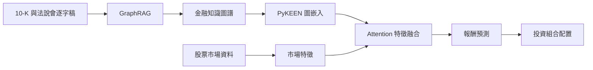

# 論文方法論修改稿

## 一、研究設計

本研究採用金融文本、知識圖譜與市場資料整合的研究架構，探討金融知識圖譜表示對股票報酬預測與投資組合配置的作用。研究流程包含金融文本處理、知識圖譜建構、圖嵌入表示學習、市場特徵整合，以及投資組合權重生成。

研究架構如下：

## 二、研究對象與資料來源

本研究以**道瓊工業平均指數 30 家成分公司**為研究對象。金融文本資料包括企業公開揭露的 **10-K 年度報告**與**法說會逐字稿**；市場資料則使用研究樣本公司的股票交易資料。

10-K 年度報告提供企業營運、財務狀況、產業環境與風險因素等正式揭露內容；法說會逐字稿包含管理階層對公司營運的說明，以及分析師與管理階層之間的問答內容。兩類文本共同作為金融實體與關係抽取的語料來源。

## 三、金融文本處理

金融文本依文件來源與公司進行整理，並切分為適合語言模型處理的文字單元。每個文字單元保留其文件來源與公司識別資訊，使抽取結果可與原始文本建立對應關係。

文本處理包括：

1. 移除不影響語意分析的格式符號與重複內容；
2. 統一文件編碼與基本文字格式；
3. 將長篇文件切分為文字單元；
4. 保存文字單元與來源文件之間的對應資訊。

## 四、GraphRAG 金融知識圖譜建構

本研究使用 GraphRAG 從金融文本中辨識實體及其關係。實體包含公司、產品、產業、地區、技術、法規、風險與市場因素等金融概念；關係則描述不同實體之間的供應、競爭、合作、曝險、營運與影響關係。

知識圖譜以三元組表示：

\[
(h,r,t)
\]

其中，\(h\) 為頭實體，\(r\) 為關係，\(t\) 為尾實體。GraphRAG 產生的實體與關係經過名稱正規化與重複項目整合後，形成金融知識圖譜。

為保留文本與圖結構之間的關聯，每筆關係均連結至其來源文字單元。此設計使知識圖譜中的關係可回溯至原始金融文本，並支援後續關係檢查與結果解釋。

## 五、知識圖譜嵌入

本研究使用 PyKEEN 訓練知識圖譜嵌入模型，將圖譜中的實體與關係轉換為低維度向量。知識圖譜嵌入透過三元組結構學習實體之間的關聯，使每家公司具有對應的圖結構表示。

對於三元組 \((h,r,t)\)，嵌入模型以評分函數衡量三元組成立的可能性：

\[
s(h,r,t)=f(\mathbf{e}_h,\mathbf{e}_r,\mathbf{e}_t)
\]

其中，\(\mathbf{e}_h\)、\(\mathbf{e}_r\) 與 \(\mathbf{e}_t\) 分別表示頭實體、關係與尾實體的嵌入向量。模型透過真實三元組與負樣本進行訓練，使有效關係取得較高評分，錯誤組合取得較低評分。

公司實體的嵌入向量作為後續特徵融合模型中的知識圖譜特徵。

## 六、市場特徵處理

市場資料以開盤價、最高價、最低價、收盤價及成交量等 OHLCV 資訊建立時間序列特徵。對每家公司建立固定長度的滾動觀察視窗，使模型根據近期市場狀態形成價格表示。

為降低不同股票價格尺度的影響，各項市場特徵在輸入模型前進行一致的數值轉換與標準化。預測目標採用下一交易期間的股票報酬，以確保輸入特徵與預測目標依時間順序對齊。

## 七、知識圖譜與市場特徵融合

本研究採用多頭注意力機制整合知識圖譜嵌入與市場特徵。公司知識圖譜嵌入形成 query 與 key，市場時間序列特徵形成 value，使模型根據公司之間的知識關聯聚合市場資訊。

注意力運算表示為：

\[
\operatorname{Attention}(Q,K,V)
=
\operatorname{softmax}\left(\frac{QK^{\mathsf T}}{\sqrt{d_k}}\right)V
\]

其中，\(Q\) 與 \(K\) 由公司知識圖譜嵌入轉換而成，\(V\) 由市場特徵轉換而成，\(d_k\) 為 key 的向量維度。多頭注意力分別學習不同表示空間中的公司關聯，再將各注意力結果合併為整合後的狀態表示。

## 八、兩階段模型訓練

本研究採用兩階段訓練方式，先建立具有金融預測能力的狀態表示，再進行投資組合配置。

### 8.1 第一階段：報酬預測

第一階段以次期股票報酬為監督訊號，訓練知識圖譜與市場特徵融合模型。模型根據當期以前可取得的金融文本表示與市場資料預測下一交易期間報酬。

第一階段的主要目的在於檢驗知識圖譜特徵是否能為市場資料提供額外資訊。模型輸出以預測誤差、方向正確率及預測值與實際報酬的相關性進行評估。

### 8.2 第二階段：投資組合配置

第二階段使用第一階段形成的狀態表示產生投資組合權重。第一階段的特徵編碼器在此階段保持固定，使投資組合配置建立於相同的金融表示基礎上，避免配置訓練改變原有特徵空間。

投資組合權重符合下列條件：

\[
w_{i,t}\geq 0,\qquad \sum_{i=1}^{N}w_{i,t}=1
\]

其中，\(w_{i,t}\) 表示第 \(t\) 期配置於第 \(i\) 家公司的資產權重，\(N\) 為研究樣本中的公司數量。

## 九、比較方法

為辨識知識圖譜特徵的作用，模型比較採用相同的市場資料、時間區間與訓練條件。主要比較組包括：

1. **知識圖譜模型**：使用知識圖譜嵌入與市場特徵；
2. **隨機嵌入模型**：以相同維度的隨機向量取代知識圖譜嵌入；
3. **價格模型**：僅使用市場特徵，不使用知識圖譜資訊；
4. **等權重策略**：將資金平均配置於研究樣本公司。

上述比較用於區分模型表現來自知識圖譜、市場資料或投資組合配置方式。

## 十、評估方法

### 10.1 知識圖譜表示評估

知識圖譜嵌入以 link prediction 指標衡量三元組表示能力，包括 Mean Reciprocal Rank（MRR）與 Hits@K。此類指標用於評估模型是否能根據已知圖結構辨識合理的實體關係。

### 10.2 報酬預測評估

第一階段採用下列指標：

- 均方誤差（Mean Squared Error, MSE）；
- 報酬方向正確率；
- Spearman rank information coefficient；
- 預測結果在不同時間區間的穩定性。

### 10.3 投資組合評估

第二階段採用下列指標：

- 累積報酬率；
- 年化報酬率；
- 年化波動率；
- Sharpe ratio；
- 最大回撤（Maximum Drawdown）；
- 投資組合周轉率。

所有模型使用一致的初始資金、交易期間、交易成本及權重限制，使各模型的績效具有可比較性。

## 十一、時間順序與資料切分

資料依時間順序劃分為訓練集、驗證集與測試集。訓練集用於模型參數學習，驗證集用於模型選擇，測試集僅用於最終評估。資料切分不採用隨機打散，以避免未來資訊進入較早的訓練期間。

金融文本與市場資料依可取得時間對齊。任一時間點的模型輸入僅包含該時間點以前已公開的文本與市場資訊，預測目標則位於輸入期間之後。此設計用於維持研究中的時間因果順序並降低前視偏誤。

## 十二、方法論主張範圍

本研究分別評估知識圖譜的結構表示能力、報酬預測效用及投資組合配置效用。知識圖譜嵌入表現用於衡量圖結構的可學習性；報酬預測比較用於衡量知識圖譜相對市場特徵的增量資訊；投資組合結果則用於衡量整合表示在資產配置任務中的應用效果。

不同層次的評估結果分別解讀。投資組合績效不直接作為知識關係事實正確性的證據，知識圖譜的結構表示能力亦不直接等同於投資績效改善。
